# ACF-SPARC Framework

[](https://badge.fury.io/js/acf-sparc)
[](https://github.com/pspesivt/acf-sparc)

Your code is probably a mess. Your projects fail predictably. ACF-SPARC fixes that.

**Repository**: [https://github.com/pspesivt/acf-sparc](https://github.com/pspesivt/acf-sparc)

## What is ACF

ACF (Agentic Continuous Flow) is a lean, AI-first software development lifecycle approach that replaces human-centric processes with ephemeral agent swarms orchestrated by ontology-driven planners, enabling small teams to deliver software continuously at dramatically higher speeds and lower costs. It fundamentally reimagines how organizations build software in an era where intelligence is no longer a human monopoly, achieving what traditional Agile cannot: 8-person teams delivering in hours what previously required 60+ people and months to accomplish.

## What Is SPARC

**S**pecification → **P**seudocode → **A**rchitecture → **R**efinement → **C**ompletion

A framework that forces you to think before you code. Highly specialized AI agents, each with one job. No overlap. No confusion. No half-assed implementations.

> **Note**: The SPARC methodology was derived and implemented based on the public work of [ruvnet](https://github.com/ruvnet). This framework represents a practical implementation of those concepts.

## Why ACF-SPARC Exists

Because you:
- Jump straight to coding without requirements
- Create "flexible" architectures that become unmaintainable nightmares  
- Skip tests until "later" (never)
- Deploy broken code and call it "MVP"

ACF-SPARC enforces discipline you lack.

## Quick Start

```bash
# Install Roo extension for VSCode

# Create a full project with a specific name
npx acf-sparc init my-project

# Create only .roo and .roomodes files in the current directory
npx acf-sparc init

# That's it. Start working.
```

## The Agents

| Agent | Role | What They Actually Do |
|-------|------|----------------------|
| **⚡ Zeus** | Orchestrator | Breaks down your vague ideas into executable tasks |
| **📋 Sherlock** | Specification Analyst | Extracts real requirements from your buzzword soup |
| **🏗️ Darwin** | Solution Designer | Creates blueprints that don't suck |
| **🐍 Monty** | Python Engineer | Writes Python. Only Python. Type-safe, tested Python |
| **🔧 Brutus** | Quality Engineer | Finds everything wrong with your code |
| **🚀 Maverick** | Deployment Engineer | Makes it run in production without burning down |
| **🔥 Prometheus** | Mode Generator | Forges new specialists when Zeus hits a wall |

## How It Works

1. **You**: "Build user authentication"
2. **Zeus**: Decomposes into 15 specific tasks
3. **Sherlock**: Documents exact requirements, constraints, edge cases
4. **Darwin**: Designs architecture, interfaces, pseudocode
5. **Monty**: Implements in Python (uv, FastAPI, SQLAlchemy, zero compromises)
6. **Brutus**: Finds 47 issues you missed
7. **Maverick**: Deploys with monitoring, rollback, the works

**But what when you need React?**

8. **Zeus**: "Need React engineer, none available"
9. **Prometheus**: Researches React ecosystem, extracts patterns, creates specialist
10. **Zeus**: Routes to new React engineer
11. **React Engineer**: Implements with TypeScript, hooks, 90% test coverage

Each agent refuses work outside their expertise. No Python engineer writing CSS. No designer writing code. No half-assed generalists.

## Full Workflow

```mermaid
%%{init: {'theme':'forest'}}%%
flowchart LR
    Start([User Request]) --> OL[⚡ Zeus: Load Context from MCP]
    OL --> PARSE[Parse & Decompose Request]
    
    PARSE --> ROUTE_SPEC{Has Specialist<br/>for Specification?}
    ROUTE_SPEC -->|Yes| SPEC[📋 Sherlock: Extract Requirements]
    ROUTE_SPEC -->|No| PROM_SPEC[🔥 Prometheus: Generate Spec Mode]
    PROM_SPEC --> SPEC
    
    SPEC --> SPEC_DOCS[📚 Scribe: Review Spec Docs]
    SPEC_DOCS --> SPEC_VALID{Requirements<br/>Complete?}
    SPEC_VALID -->|No| SPEC
    SPEC_VALID -->|Yes| HANDOFF_S2P[Handoff: requirements.md,<br/>constraints.md, acceptance-criteria.md]
    
    HANDOFF_S2P --> PSEUDO[🏗️ Darwin: Create Pseudocode<br/>+ TDD Anchors]
    PSEUDO --> PSEUDO_VALID{All Requirements<br/>Mapped?}
    PSEUDO_VALID -->|No| BACK_SPEC[Back to Specification]
    BACK_SPEC --> SPEC
    PSEUDO_VALID -->|Yes| ARCH[🏗️ Darwin: Design Architecture]
    
    ARCH --> ARCH_RESEARCH[Research Best Practices<br/>via Perplexity MCP]
    ARCH_RESEARCH --> ARCH_DOCS[📚 Scribe: Architecture Records]
    ARCH_DOCS --> ARCH_VALID{Design<br/>Feasible?}
    ARCH_VALID -->|No| BACK_PSEUDO[Back to Pseudocode]
    BACK_PSEUDO --> PSEUDO
    ARCH_VALID -->|Yes| HANDOFF_A2R[Handoff: system-design.md,<br/>component-interfaces.md]
    
    HANDOFF_A2R --> CHECK_IMPL{Has Implementation<br/>Specialist?}
    CHECK_IMPL -->|No| PROM_CREATE[🔥 Prometheus: Create New Mode]
    PROM_CREATE --> UPDATE_ROUTES[Update Routing Matrix<br/>& .roomodes]
    UPDATE_ROUTES --> IMPL
    CHECK_IMPL -->|Yes| IMPL[🐍/⚛️ Engineer: Implement Code]
    
    IMPL --> IMPL_MCP["Load Conventions (OpenMemory)<br/>Get API Docs (Context7)"]
    IMPL_MCP --> IMPL_WORK[Write Code + Tests]
    IMPL_WORK --> IMPL_BLOCKED{Work<br/>Blocked?}
    IMPL_BLOCKED -->|Wrong Language| BOUNCE_IMPL[Bounce to Orchestrator]
    BOUNCE_IMPL --> CHECK_IMPL
    IMPL_BLOCKED -->|Missing Info| BACK_ARCH[Back to Architecture]
    BACK_ARCH --> ARCH
    IMPL_BLOCKED -->|No| IMPL_DOCS[📚 Scribe: Generate API Docs]
    
    IMPL_DOCS --> HANDOFF_I2Q[Handoff: src/, tests/]
    HANDOFF_I2Q --> QUALITY[🔧 Brutus: Quality Analysis]
    QUALITY --> Q_SCAN[Static Analysis<br/>Security Scan<br/>Performance Profile]
    Q_SCAN --> Q_ISSUES{Critical<br/>Issues?}
    Q_ISSUES -->|Yes| CREATE_BACKLOG[Create Issue Backlog]
    CREATE_BACKLOG --> FIX_LOOP[Route Fixes to Engineers]
    FIX_LOOP --> IMPL
    Q_ISSUES -->|No| HANDOFF_Q2D[Handoff: Quality Report]
    
    HANDOFF_Q2D --> DEPLOY[🚀 Maverick: Deployment]
    DEPLOY --> D_SETUP[Setup CI/CD<br/>Configure Monitoring]
    D_SETUP --> D_DOCS[📚 Scribe: Create Runbooks]
    D_DOCS --> D_VALID{Deployment<br/>Successful?}
    D_VALID -->|No| FIX_DEPLOY[Fix Deployment Issues]
    FIX_DEPLOY --> DEPLOY
    D_VALID -->|Yes| FINAL_DOCS[📚 Scribe: Finalize All Docs]
    
    FINAL_DOCS --> COMPLETE([Project Complete])
    
    style Start fill:#90EE90
    style COMPLETE fill:#90EE90
    style PROM_SPEC fill:#FFB6C1
    style PROM_CREATE fill:#FFB6C1
    style BOUNCE_IMPL fill:#FFA07A
    style BACK_SPEC fill:#FFA07A
    style BACK_PSEUDO fill:#FFA07A
    style BACK_ARCH fill:#FFA07A
    style FIX_LOOP fill:#FFA07A
```

```mermaid
%%{init: {'theme':'forest'}}%%
sequenceDiagram
    participant U as User
    participant Z as ⚡ Zeus (Orchestrator)
    participant M as 🧠 MCP Services
    participant S as 📋 Sherlock (Spec)
    participant D as 🏗️ Darwin (Design)
    participant P as 🔥 Prometheus (Mode Gen)
    participant E as 🐍/⚛️ Engineers
    participant B as 🔧 Brutus (Refine)
    participant V as 🚀 Maverick (Deploy)
    participant SC as 📚 Scribe (Docs)
    
    U->>Z: Project request
    Z->>M: Load all memories
    
    %% Specification Phase
    Z->>S: Route specification work
    S->>M: Load constraints/requirements
    S->>S: Extract requirements
    S->>S: Define acceptance criteria
    S->>SC: Trigger doc review
    SC-->>S: Review requirements docs
    S->>Z: Handoff: requirements.md, constraints.md
    
    %% Pseudocode Phase
    Z->>D: Route design work
    D->>M: Load architecture decisions
    D->>D: Create pseudocode
    D->>D: Add TDD anchors
    D->>Z: Handoff: pseudocode/, test-scenarios.md
    
    %% Architecture Phase
    Z->>D: Continue architecture
    D->>M: Research patterns (Perplexity)
    D->>D: Design components
    D->>D: Define interfaces
    D->>SC: Trigger architecture docs
    SC-->>D: Create architecture records
    D->>Z: Handoff: system-design.md, interfaces.md
    
    %% Refinement Phase - Check for specialist
    Z->>Z: Check available modes
    
    alt No suitable specialist exists
        Z->>P: Need new specialist
        P->>M: Research domain expertise
        P->>P: Generate mode rules
        P->>Z: New mode created
        Z->>Z: Update routing matrix
    end
    
    Z->>E: Route implementation
    E->>M: Load conventions (OpenMemory)
    E->>M: Get library docs (Context7)
    E->>E: Implement code
    E->>E: Write tests
    E->>SC: Trigger API docs
    SC-->>E: Generate documentation
    
    alt Implementation blocked
        E->>Z: Bounce: wrong language/scope
        Z->>Z: Find correct specialist
        Z->>E: Re-route to correct mode
    end
    
    E->>Z: Handoff: src/, tests/
    
    %% Quality Check
    Z->>B: Route quality analysis
    B->>M: Load quality standards
    B->>B: Static analysis
    B->>B: Security scan
    B->>B: Performance profiling
    B->>Z: Handoff: issue backlog
    
    alt Critical issues found
        Z->>E: Route fixes
        E->>E: Fix issues
        E->>Z: Fixed code
        Z->>B: Re-analyze
    end
    
    %% Completion Phase
    Z->>V: Route deployment
    V->>M: Load deployment history
    V->>V: Setup CI/CD
    V->>V: Configure monitoring
    V->>SC: Trigger deployment docs
    SC-->>V: Create runbooks
    V->>Z: Handoff: deployed, monitored
    
    %% Final Documentation
    Z->>SC: Finalize all docs
    SC->>SC: Update README
    SC->>SC: Update CHANGELOG
    SC->>Z: Documentation complete
    
    Z->>U: Project complete
```





## Project Structure

```
.roomodes                   # Agent definitions
.roo/
├── rules/                  # Universal rules ALL agents follow
│   ├── 01-sparc-methodology.md
│   ├── 02-mcp-integration.md
│   ├── 03-tool-conventions.md
│   ├── 04-handoff-protocol.md
│   ├── 05-git-conventions.md
│   └── 06-error-prevention.md
├── rules-orchestrator/     # Zeus-specific rules
├── rules-spec/            # Sherlock-specific rules
├── rules-design/          # Darwin-specific rules
├── rules-python-engineer/ # Monty-specific rules
├── rules-refine/          # Brutus-specific rules
└── rules-deploy/          # Maverick-specific rules
```

## Usage

### Starting a Project

```yaml
# Tell any agent what you want
You: "I need a REST API for task management"

# Zeus takes over
Zeus: "Breaking down into ACF-SPARC phases..."
```

### Working with Specific Agents

```yaml
# Direct task to specific agent (Zeus handles routing)
You: "The login endpoint is slow"

Zeus → Brutus: "Profile login performance"
Brutus: "Found N+1 query, 3 second response time"
Zeus → Monty: "Fix N+1 query in login endpoint"
```

## Non-Negotiable Conventions

### Git Commits
```
feat(api): add user authentication endpoint
fix(auth): resolve token expiration issue  
docs(readme): update installation steps
```

Atomic commits. One change per commit. No "various fixes" garbage.

### Python Stack
- **uv**: Package management (not pip, not poetry, not conda)
- **Ruff**: Formatting and linting
- **mypy**: Type checking with --strict
- **pytest**: Testing with 90% coverage minimum
- **FastAPI**: Async APIs only
- **SQLAlchemy 2.0**: Type-safe ORM
- **Alembic**: Database migrations

### Documentation
```
docs/
├── specifications/   # What to build
├── architecture/     # How it's designed
├── api/             # How to use it
└── deployment/      # How to run it
```

## Common Failures

**Your Mistake**: "Zeus, implement the login feature"  
**Result**: Rejected. Orchestrators don't code.

**Your Mistake**: "Monty, fix this React component"  
**Result**: Rejected. Python engineer doesn't touch JavaScript.

**Your Mistake**: "Brutus, fix these bugs you found"  
**Result**: Rejected. Quality engineers identify, not fix.

**Your Mistake**: Skipping specification phase  
**Result**: Building the wrong thing perfectly.

## Modifying the Framework

### Editing Framework Rules

To modify the ACF-SPARC framework:

1. **Clone the repository**:
   ```bash
   git clone https://github.com/pspesivt/acf-sparc.git
   cd acf-sparc
   ```

2. **Edit source files** in the `src/` directory:
   - `src/rules/` - Universal rules that ALL agents follow
   - `src/rules-*/` - Specialist-specific rules for each agent

3. **Set up minification environment**:
   ```bash
   # Install Python dependencies
   pip install -r requirements.txt
   
   # Create .env file from template
   cp .env.sample .env
   
   # Edit .env to configure your LLM API settings
   ```

4. **Configure .env file** for minification:
   ```env
   # Required: Your OpenAI-compatible API key
   OPENAI_API_KEY=your-api-key-here
   
   # API endpoint (default: http://localhost:4000 for local proxy)
   OPENAI_BASE_URL=http://localhost:4000
   
   # Model to use for compression (default: o4-mini-2025-04-16)
   LLM_MODEL=o4-mini-2025-04-16
   ```

   Supported models include:
   - `o4-mini-2025-04-16` (recommended for minification)
   - `claude-3-5-haiku-latest`
   - `claude-3-7-sonnet-20250219`
   - Custom models via OpenAI-compatible endpoints

5. **Run minification** to optimize the instruction set:
   ```bash
   python minify.py
   ```

   The `minify.py` script:
   - Reads source files from `src/`
   - Creates human-readable optimized version in `templates/base/.roo/`
   - Creates aggressively minified version in `templates/minimal/.roo/`
   - Uses LLM-based semantic compression to reduce token usage
   - Preserves all functionality while optimizing for context windows

6. **Test changes** by initializing a new project:
   ```bash
   npm link  # Link your local version
   npx acf-sparc init test-project
   ```

### Framework Architecture

The framework uses three versions of instructions:

- **Source version** in `src/` (~100,421 tokens)
  - Uncompressed, fully documented source files
  - This is where all edits should be made

- **Human-readable optimized** in `templates/base/.roo/` (~67,126 tokens)
  - 33% token reduction while maintaining readability
  - Generated by `minify.py` using Claude Sonnet

- **Aggressively minified** in `templates/minimal/.roo/` (~55,879 tokens)  
  - 44% token reduction for production use
  - Generated by `minify.py` using o4-mini
  - Machine-optimized, not human-readable

### Minification Process

The minification process requires an LLM API to compress instructions while preserving semantic meaning:

1. **Local proxy setup** (recommended):
   - Use tools like LiteLLM or similar to proxy requests
   - Configure `OPENAI_BASE_URL=http://localhost:4000`
   - Supports multiple model providers through unified interface

2. **Direct API usage**:
   - Set `OPENAI_BASE_URL` to your provider's endpoint
   - Use appropriate `LLM_MODEL` for your provider
   - Ensure API key has sufficient credits for processing

Never edit files in `templates/` directly - always modify `src/` and run minification.

## Creating New Specialists

**Your Problem**: Need Go microservices, Rust systems code, or React frontends?  
**Old Solution**: Force Python engineer to "figure it out" (disaster)  
**SPARC Solution**: Prometheus creates proper specialists

```bash
# Zeus encounters unsupported task
You: "Build React dashboard"
Zeus: "No React engineer available, summoning Prometheus"

# Prometheus researches and creates
Prometheus: "Analyzing React ecosystem..."
- Studies official docs
- Extracts best practices  
- Generates specialist rules
- Updates orchestrator

# New specialist ready
Zeus: "React engineer created, routing task"
React Engineer: "⚛️ TypeScript and hooks only. No jQuery garbage."
```

### What Prometheus Creates:

- Language specialists (go-engineer, rust-engineer)
- Framework specialists (react-engineer, vue-engineer)
- Domain specialists (ml-engineer, mobile-engineer)

### What Prometheus Refuses:

- Generic "full-stack" modes
- Task-specific micro-modes
- Escape hatches for lazy routing

## Performance

- Requirements extraction: 2-5 minutes
- Architecture design: 5-10 minutes  
- Implementation: Depends on complexity
- Quality analysis: 3-5 minutes per 1000 lines
- Deployment setup: 10-15 minutes

Compare to your current approach: Weeks of wrong implementations.

## Extending ACF-SPARC

### Automatic Specialist Generation

When Zeus can't route a task:

1. Prometheus analyzes the gap
2. Researches domain
3. Generates specialist rules
4. Updates orchestration matrix
5. New mode immediately available

No manual mode creation. No half-assed generalists.

### Manual Mode Addition (Deprecated)

Still works, but why? Let Prometheus handle it.

### Adding Standards

Edit files in `rules/`. All agents follow these immediately.

## The Reality

ACF-SPARC isn't magic. It's discipline enforced by specialization.

Your current approach:
1. Vague idea
2. Start coding  
3. Realize it's wrong
4. Hack fixes
5. Deploy garbage
6. Maintain nightmare

ACF-SPARC approach:
1. Clear requirements
2. Validated design
3. Clean implementation
4. Caught issues
5. Smooth deployment
6. Maintainable system

Choose your suffering: Upfront discipline or eternal maintenance hell.

The framework exists because developers consistently choose shortcuts that become detours.

ACF-SPARC now self-extends. Need new expertise? Don't compromise quality with generalists. Prometheus ensures every specialist meets the same brutal standards.

Your "full-stack" developer who "knows everything"? They know nothing well. ACF-SPARC specialists know one thing excellently.

Choose: Excellence through specialization or mediocrity through generalization.

## License

MIT. Take it, use it, stop writing garbage.

## Contributing

This framework is opinionated by design. Fork it if you disagree.

---

**Final Note**: Every failed project skipped at least one ACF-SPARC phase. Every successful project followed something similar, whether they called it ACF-SPARC or not.

The framework exists because developers consistently choose shortcuts that become detours.

Stop choosing detours.
