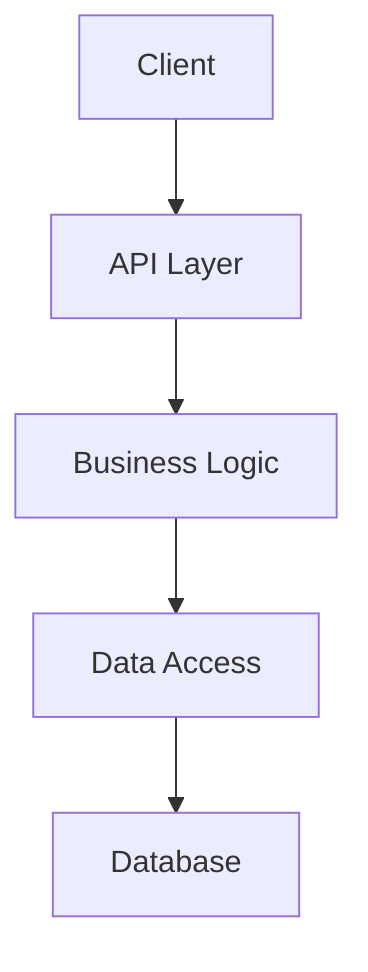

# Project Name


[](https://travis-ci.org/username/project)
[](https://codecov.io/gh/username/project)
[](LICENSE.md)
[](https://github.com/username/project/releases)

A concise description of what this project does and who it's for. Keep it to 1-2 sentences.

## Features

* **Key Feature 1**: Brief explanation with highlight of benefit
* **Key Feature 2**: Brief explanation with highlight of benefit
* **Key Feature 3**: Brief explanation with highlight of benefit
* **Key Feature 4**: Brief explanation with highlight of benefit

## Installation

### Prerequisites

* Requirement 1 (with version if applicable)
* Requirement 2 (with version if applicable)

### Standard Installation

```bash
# Clone the repository
git clone https://github.com/username/project.git

# Enter the project directory
cd project

# Install dependencies
npm install

# Build the project
npm run build
```

### Docker Installation

```bash
# Pull the image
docker pull username/project

# Run the container
docker run -p 8080:8080 username/project
```

## Quick Start

```javascript
// A minimal working example that shows the core functionality
import { mainFunction } from 'project';

const result = mainFunction({
  param1: 'value1',
  param2: 'value2'
});

console.log(result);
```

## Usage Examples

### Example 1: Basic Use Case

```javascript
// Code example with comments
```

### Example 2: Advanced Use Case

```javascript
// Code example with comments
```

## Architecture



## API Reference

For detailed API documentation, see the [API Reference](docs/api/README.md).

### Key Endpoints

| Endpoint | Method | Description |
|----------|--------|-------------|
| `/api/resource` | GET | Retrieve resources |
| `/api/resource/:id` | GET | Retrieve a specific resource |
| `/api/resource` | POST | Create a new resource |
| `/api/resource/:id` | PUT | Update a specific resource |
| `/api/resource/:id` | DELETE | Delete a specific resource |

## Configuration

```yaml
# Example configuration file
server:
  port: 8080
  host: localhost

database:
  host: localhost
  port: 5432
  name: mydatabase

logging:
  level: info
  format: json
```

## Performance

| Operation | Speed | Memory Usage |
|-----------|-------|-------------|
| Operation 1 | 10ms | 5MB |
| Operation 2 | 5ms | 2MB |
| Operation 3 | 15ms | 8MB |

## Security

For security issues, please see [SECURITY.md](SECURITY.md).

## Contributing

Contributions are welcome! Please see [CONTRIBUTING.md](CONTRIBUTING.md) for details.

## Testing

```bash
# Run unit tests
npm test

# Run integration tests
npm run test:integration

# Run end-to-end tests
npm run test:e2e
```

## Deployment

For detailed deployment instructions, see the [Deployment Guide](docs/deployment/README.md).

### Basic Deployment

```bash
# Deploy to production
npm run deploy
```

## Roadmap

- [x] Feature 1
- [x] Feature 2
- [ ] Feature 3
- [ ] Feature 4

## License

This project is licensed under the MIT License - see the [LICENSE.md](LICENSE.md) file for details.

## Acknowledgments

* Library/Tool 1 - Brief description
* Library/Tool 2 - Brief description
* Person/Organization - Brief description of contribution

## Contact

Project Link: [https://github.com/username/project](https://github.com/username/project)
