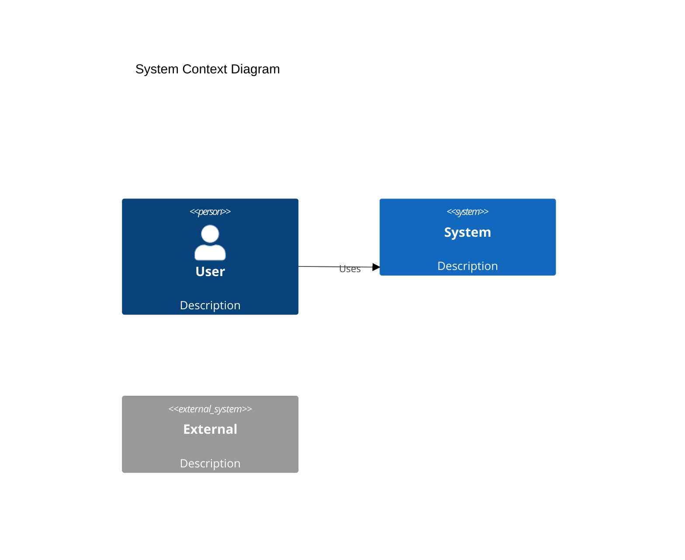
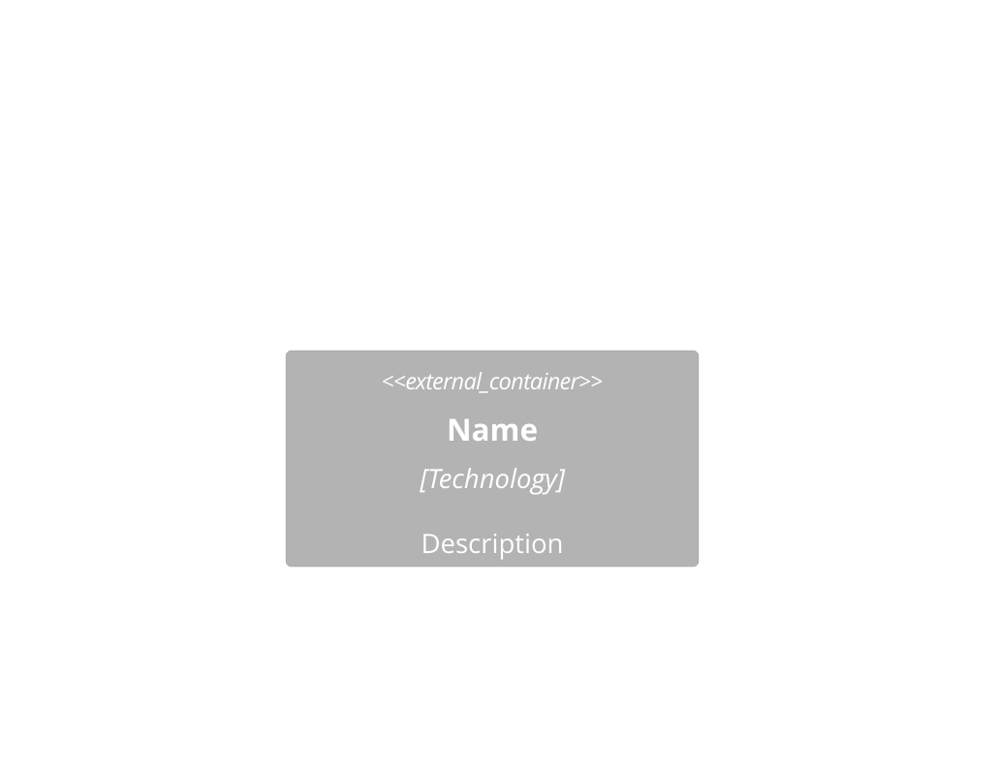
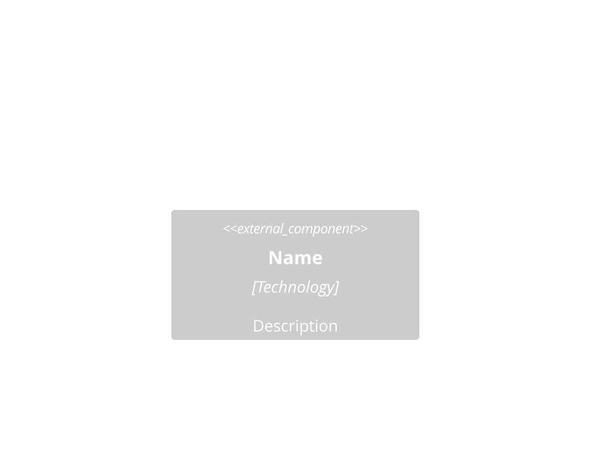
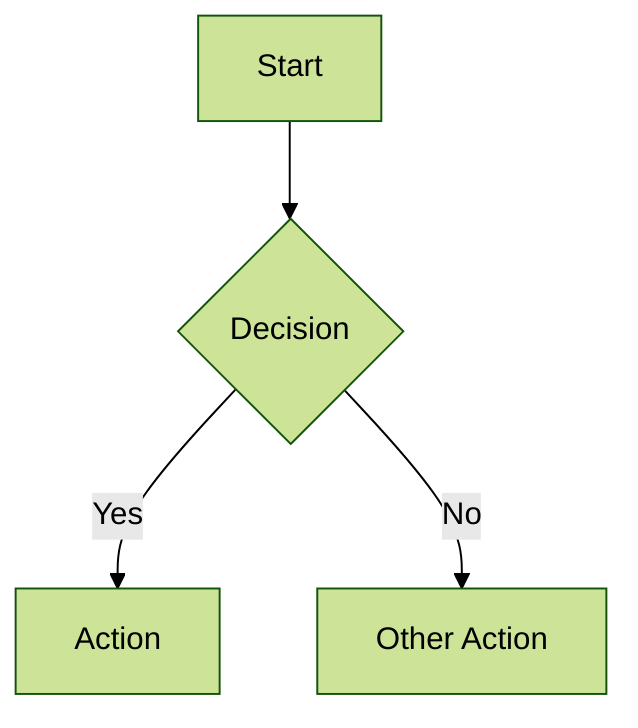
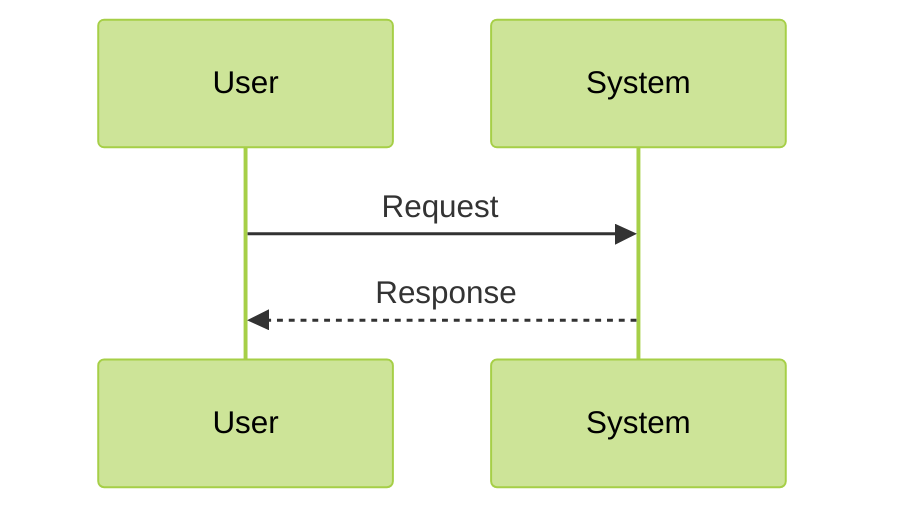

## Diagram Conventions

All diagrams use mermaid with forest theme. No exceptions.

### Required Header
```
%%{init: {'theme':'forest'}}%%
```

### C4 Architecture Levels

**Level 1 - System Context**:


**Level 2 - Container**:


**Level 3 - Component**:


### Other Diagram Types

**Flow Diagrams**:


**Sequence Diagrams**:


Any other mermaid supported diagram types.

### Anti-Patterns
- No theme specified (defaults look amateur)
- Mixing diagram styles (pick one notation)
- Box-and-arrow soup (use C4 hierarchy)
- Wall of text in boxes (concise labels only)
