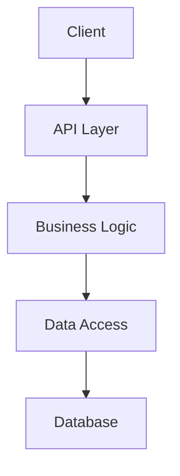

# Project Name

## Features
- Key Feature 1;Key Feature 2;Key Feature 3;Key Feature 4

## Installation
### Prerequisites
Prerequisites:[Requirement1,Requirement2]
### Standard Installation
```bash
git clone https://github.com/username/project.git&&cd project&&npm install&&npm run build
```
### Docker Installation
```bash
docker pull username/project&&docker run -p 8080:8080 username/project
```

## Quick Start
```javascript
import{mainFunction}from'project';const r=mainFunction({param1:'value1',param2:'value2'});console.log(r);
```

## Architecture


## API Reference
docs/api/README.md
### Key Endpoints
- GET /api/resource Retrieve resources
- GET /api/resource/:id Retrieve specific resource
- POST /api/resource Create resource
- PUT /api/resource/:id Update resource
- DELETE /api/resource/:id Delete resource

## Configuration
```yaml
server:
  port: 8080
  host: localhost
database:
  host: localhost
  port: 5432
  name: mydatabase
logging:
  level: info
  format: json
```

## Performance
- Operation1:10ms/5MB
- Operation2:5ms/2MB
- Operation3:15ms/8MB

## Security
SECURITY.md

## Contributing
CONTRIBUTING.md

## Testing
```bash
npm test&&npm run test:integration&&npm run test:e2e
```

## Deployment
docs/deployment/README.md
```bash
npm run deploy
```

## Roadmap
- Feature1:done
- Feature2:done
- Feature3:todo
- Feature4:todo

## License
MIT License;LICENSE.md

## Acknowledgments
Library/Tool1;Library/Tool2;Person/Organization

## Contact
https://github.com/username/project